# 🎮 실시간 멀티플레이 카드 배틀 게임

Real-Time Multiplayer Card Battle Game

---

  

  
  
  
  

# 📑 목차

1. [프로젝트 소개](#프로젝트-소개)
2. [팀원 소개](#팀원-소개)
3. [개발 환경 및 개발 기간](#개발-환경-및-개발-기간)
4. [기술 스택](#기술-스택)
5. [주요 기능](#주요-기능)
6. [실행 화면](#실행-화면)
7. [프로젝트 후기](#프로젝트-후기)

---

# 📘 프로젝트 소개

이 프로젝트는 **실시간 온라인 카드 배틀 게임**으로,  
Socket.IO 기반 실시간 전투, 카드 소환·공격, 카드팩·덱 시스템,  
3D 모델 렌더링(React Three Fiber), JWT 인증 등  
웹 게임의 전체 시스템을 직접 구현한 Full-Stack 웹 프로젝트입니다.

프론트엔드와 백엔드가 모두 사용자 정의 로직으로 구성되어 있으며,  
실시간성·3D 인터랙션·UI/UX 등 다양한 기술을 포함합니다.

---

# 👥 팀원 소개

| 구분 | 이름   | 역할                                                                 | GitHub                                                                                                                    |
| ---- | ------ | -------------------------------------------------------------------- | ------------------------------------------------------------------------------------------------------------------------- |
| 팀장 | 김민수 | 프론트엔드 개발 총괄   프로젝트 아키텍처 설계 및 구조 최적화      |              |
| 팀원 | 김태중 | 백엔드 총괄   서버 인프라 구축 및 운영, 관리   DB 설계 및 구축 |              |
| 팀원 | 김현민 | QA 및 오류 수정                                                      | 준비 중                                                                                                                   |
| 팀원 | 강병욱 | QA 및 오류 수정                                                      |  |
|      |

---

# 🛠 개발 환경 및 개발 기간

## 📌 개발 환경

---

## 🎮 Frontend

| 기술                                                                                                                                                                                                      | 설명                                       |
| --------------------------------------------------------------------------------------------------------------------------------------------------------------------------------------------------------- | ------------------------------------------ |
|                                                                                                                  | TypeScript 기반 SPA 구조로 제작            |
|                                                                                                           | 컴포넌트 타입 안정성 확보                  |
|                                                                                             | 로그인/메인/전투 등 페이지 라우팅          |
|                                                                                                    | 실시간 전투 상태 동기화                    |
|   | 3D GLTF 렌더링, 셰이더, 카메라/라이트 제어 |
|                                                                                                                 | useGLTF, shadows 등 편의 기능              |
|                                                                                                  | 카드팩 개봉·버튼·모달 등 UI 애니메이션     |

| 🎵 SoundManager | Web Audio API 기반 커스텀 사운드 엔진 |

> **상세 설명은 접어서 보기**

자세히 보기

- Context 기반 사용자 상태 및 소켓 상태 유지
- 전투 UI, 인벤토리, 3D 도감 커스텀 디자인
- 페이지 전역 BGM 유지 시스템 구축

---

## 🔧 Backend

| 기술                                                                                                    | 설명                                     |
| ------------------------------------------------------------------------------------------------------- | ---------------------------------------- |
|          | Express 기반 서버 운영                   |
|          | REST API 구성                            |
|         | API·전투 로직 전체 타입 안정성           |
|  | 방 생성/공격/이벤트 실시간 처리          |
|          | User/Card/Deck/Pack 스키마 설계          |
| 🔐 JWT + Bcrypt                                                                                         | 인증/암호화 기반 보안 구현               |
| 🎮 전투 로직 엔진                                                                                       | typeChart·attack·shuffle·event 로직 구현 |

전투 로직 상세

- 타입 상성(typeChart) 12종 지원
- 데미지 계산(calcDamage)
- 묘지/셔플 알고리즘
- Host/Guest 턴 동기화
- 이벤트 몬스터 보상 시스템
- 실시간 타이머 기반 턴 관리

---

## 🗂 Database

| 기술                                                                                                        | 설명                     |
| ----------------------------------------------------------------------------------------------------------- | ------------------------ |
|  | 클라우드 기반 NoSQL 운영 |
|           | 데이터 모델링 · ORM 기능 |

---

## 🖥 IDE & Tools

| Tool                                                                                                   | 설명                     |
| ------------------------------------------------------------------------------------------------------ | ------------------------ |
|  | 전체 개발/디버깅 환경    |
|         | GLTF 3D 모델 제작/경량화 |
|                                  | FE·BE 배포 및 서버 운영  |
|            | 버전 관리 및 협업        |
| ESLint / Prettier                                                                                      | 코드 품질 유지           |

---

## 📦 Version Control

- Git 기반 버전 관리
- GitHub repo 관리
- `master / server / structure` 등 기능별 브랜치 운영
- 이슈 기반 개발 프로세스 적용

---

# 🗓 개발 기간 (Timeline)

- **2024.12 ~ 2025.11 (총 약 11개월)**
  - **1~2개월차:** 기획, 화면 설계, DB 모델링, 프로젝트 초기 구조 세팅
  - **3~5개월차:** 백엔드 API · 인증 · 덱/카드 시스템 구현
  - **5~7개월차:** Socket.IO 기반 실시간 전투 구조 완성
  - **7~9개월차:** 전투 UI, 이벤트 시스템, 전투 로직 정교화
  - **9~10개월차:** 3D 도감, 3D 전투 오브젝트, 이펙트 추가
  - **10~11개월차:** 배포, 성능 최적화, 디자인 개선, 버그 수정

---

# 🧩 기술 스택

## 🎮 Frontend

### ✔ React + TypeScript

- 컴포넌트 기반 UI 설계
- Props/State 타입 안정성 확보
- 유지보수성과 재사용성 극대화
- BattlePage, StorePage, DexPage 등 페이지 단위 구조화

### ✔ React Router

- /login, /main, /store, /inventory, /dex, /battle 등 다중 라우팅 구성
- private route 처리로 인증 기반 페이지 보호

### ✔ React Three Fiber (Three.js 기반)

- GLB 모델 로딩 및 렌더링
- 카드 소환 시 필드 위에 3D 모델 배치
- 카메라, 조명, 쉐이더 제어
- 70여 종의 몬스터형 3D 모델 최적화

### ✔ Drei (R3F 유틸)

- useGLTF, OrbitControls, ContactShadows 등 편리 기능 사용
- 로딩 최적화 및 Scene 관리 단순화

### ✔ Framer Motion

- 카드팩 개봉 애니메이션
- 버튼 호버·클릭 모션
- 모달 창 전환 효과
- 승리/패배 UI 애니메이션

### ✔ Socket.IO-client

- 실시간 카드 소환, 공격, 이벤트, 턴 전환 동기화
- 방 입장/퇴장, 상태·gameState 업데이트 처리
- 서버 이벤트와 1:1 매칭하여 즉각적인 UI 업데이트

### ✔ Custom SoundManager (Web Audio API)

- 모든 사운드 파일을 관리하는 중앙 오디오 시스템 구현
- 카드 공격/피격/회복/폭탄/턴 전환/승·패 등 상황별 효과음 재생
- 글로벌 BGM 유지 및 페이지 간 지속 기능 제공

### ✔ JWT 기반 인증

- 로그인 후 토큰 저장 및 자동 인증 처리
- Axios 인터셉터로 Authorization 헤더 자동 추가

### ✔ 반응형 UI

- 전투 화면 레이아웃 최적화
- 모바일/데스크탑 UI 구조 통합 관리
- CSS + custom responsive layout

---

## 🔧 Backend

### ✔ Node.js + Express

- REST API 서버 구축
- 회원가입/로그인(JWT) 구현
- 상점(카드팩 구매), 인벤토리, 덱 구성 등 비즈니스 로직 처리
- express.Router 기반 모듈화된 라우팅

### ✔ TypeScript

- 전투 로직, DB 모델, 소켓 이벤트 모두 정적 타입으로 관리
- RoomInfo, GameState, CardData 등 공통 타입 정의해 프론트·백엔드 공유 구조 유지

### ✔ MongoDB + Mongoose

- User / Card / UserDeck / UserCard / CardPack 등 주요 스키마 설계
- 카드팩 확률 기반 카드 지급 로직 DB와 연결
- 중복 방지 / 인덱싱 / refs 사용으로 구조적 데이터 관리

### ✔ Socket.IO Server

- 실시간 멀티플레이 핵심 구성
- 방 생성·참여·퇴장 처리
- Host/Guest 구분 후 턴 관리
- 소환/공격/피해/이벤트 등 모든 실시간 이벤트 브로드캐스트
- 서버 단에서 턴 타이머(30초) 관리 → 클라이언트 동기화

### ✔ JWT Auth + Bcrypt

- ID/PW 회원가입 및 인증 로직
- 비밀번호 암호화 저장
- 토큰 검증 미들웨어(isAuthenticated) 작성
- 인증 실패 시 접근 차단 처리

### ✔ 실시간 전투 로직 엔진

프로젝트의 핵심 기능으로, 아래 요소들 포함:

- **데미지 계산 시스템**

  - typeChart 기반 상성 계산 (x1.5, x0.5)
  - Worm 포함 12타입 상성 테이블 직접 정의

- **코스트 시스템**

  - 턴마다 cost 증가 알고리즘
  - 이벤트 발생 시 추가 cost 제공

- **묘지/셔플 시스템**

  - 카드 파괴 → graveyard 이동
  - 셔플 시 HP 패널티(300)
  - 손패 복귀 확률 로직

- **이벤트 몬스터 시스템**

  - 랜덤 이벤트 등장
  - 폭탄/힐/코스트 증가 보상 로직

- **Host/Guest 턴 관리**

  - 서버에서 전투 턴 흐름 관리
  - 시간 초과 시 자동 턴 넘김

- **클린업 시스템**
  - 게임 종료 시 방/소켓/메모리 데이터 정리

---

# 🚀 주요 기능

## 🔐 인증 시스템 (Authentication)

- **JWT 기반 회원가입 / 로그인**
  - ID, PW 등록 및 비밀번호 Bcrypt 암호화 저장
  - 로그인 성공 시 JWT 발급 및 클라이언트 로컬 보관
- **프로필 수정 기능**
  - 닉네임 변경
  - 비밀번호 변경
- **로그인 상태 유지**
  - 모든 Axios 요청에 Authorization 헤더 자동 첨부
  - 토큰 만료 시 자동 로그아웃 처리

---

## 🧭 메인 페이지 (MainPage)

- **사용자 정보 표시**
  - 닉네임, 보유 금액(money) 실시간 표시
  - 로그인 유저 기반 DB에서 정보 Fetch
- **랜덤 테마(7종) 자동 적용**
  - 페이지 이동 or 새로고침 시 테마 변경
  - 글로벌 스타일 연동
- **전역 BGM 유지**
  - 페이지 이동 여부와 상관없이 끊기지 않는 글로벌 배경음악 기능

---

## 🏪 상점(Store)

- **카드팩 구매 (B / A / S 등급)**
  - 팩 등급별 가격 설정
- **확률 기반 카드 획득 시스템**
  - 각 팩은 등급별 등장 확률 고유
  - MongoDB에서 카드 정보를 읽어 확률 반영
- **즉시 DB 반영**
  - 구매 → UserCard 또는 UserPack에 저장

---

## 🎒 인벤토리(Inventory)

- **보유 카드팩 목록 조회**
- **팩 오픈 애니메이션**
  - Framer Motion으로 카드 팩 오픈 연출
- **카드 결과 팝업 표시**
  - 오픈한 카드의 상세 정보 표시

---

## 📚 도감(Dex)

- **React Three Fiber 기반 3D GLTF 렌더링**
  - 모든 카드에 대해 3D 모델 표시
- **소유 여부별 모델 컬러 차등**
  - 소유 → 컬러
  - 미보유 → 그레이스케일 셰이더 적용
- **70+ GLTF 모델 로딩 최적화**
  - Preload / Suspense 활용

---

# ⚔ 전투 시스템 (Battle System)

전투 시스템은 이 프로젝트의 핵심이며 **Socket.IO**와 **React Three Fiber**, **전투 로직 엔진**이 결합된 구조로 작동합니다.

---

## 🔌 실시간 멀티플레이

- **방 생성 / 참여**
  - Host / Guest 자동 배정
- **유저 간 정보 실시간 동기화**
  - 닉네임, 체력, 코스트, 손패, 필드 정보
- **턴 기반 전투 흐름**
  - Host → Guest → Host 순서로 턴 진행
- **턴 전환 브로드캐스트**
  - 30초 타이머 기반 자동 턴 종료 기능 포함

---

## 🃏 카드 소환 & 공격 시스템

- **드래그 앤 드롭 카드 소환 UI**
- **필드 중복 방지 로직**
  - 동일 슬롯에 중복 접근 불가
- **canAttack 플래그로 공격 가능 여부 제어**
  - 턴 시작 시 갱신
- **카드 대상 지정 공격**
  - 필드 카드 또는 플레이어 직접 공격

---

## 🔥 타입 상성(typeChart)

- **총 12종 타입 상성 적용**
  - Normal, Fire, Water, Electric, Ice, Forest, Fly, Land, Poison, Esper, Legend, Worm
- **상성 보정값 적용**
  - Super: x1.5
  - Weak: x0.5
  - Normal: x1.0
- **백엔드 로직에서 damage 계산 처리**

---

## 💥 데미지·피격 시스템

- **피격 시 UI 흔들림 효과**
  - 공격 대상 카드 또는 플레이어 UI shake
- **데미지 팝업 표시**
  - Super / Weak / Normal 데미지 타입별로 다른 연출
- **HP 0 도달 시 파괴 로직**
  - 필드 카드 제거 → 묘지 이동

---

## 🎲 이벤트 시스템 (Event Monsters)

- 일정 턴마다 랜덤 이벤트 등장
- 보상 3종:
  - **폭탄(Bomb)** → 상대 HP -200
  - **회복(Heal)** → 내 HP +300
  - **코스트 증가(Cost+)** → 다음 턴 코스트 +3
- 애니메이션 및 SoundManager 연동

---

## 💀 묘지 및 셔플 시스템

- **카드 파괴 시 묘지(Graveyard)로 이동**
- **셔플 시 HP -300 페널티**
- **셔플 성공 시 랜덤 카드 손패 복귀**
- 셔플 애니메이션으로 시각적 효과 강화

---

## 📨 전투 로그 & 인게임 채팅

### 📘 전투 로그

- 카드 소환
- 공격 / 피격 / 데미지 정보
- 이벤트 발동
- 턴 종료
  → 모든 전투 기록을 실시간 출력

### 💬 인게임 채팅

- 화면 원하는 곳에 배치 가능한 Draggable Chat 구현
- 상대와 자유롭게 메시지 교환 가능

---

# 🖼 실행 화면

---

## 🔐 로그인 & 회원가입

📸 이미지 보기

 

### 🔐 로그인

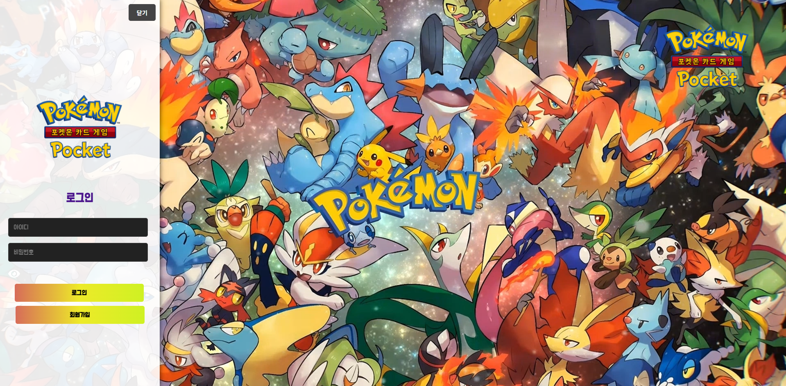

### 🔐 회원가입

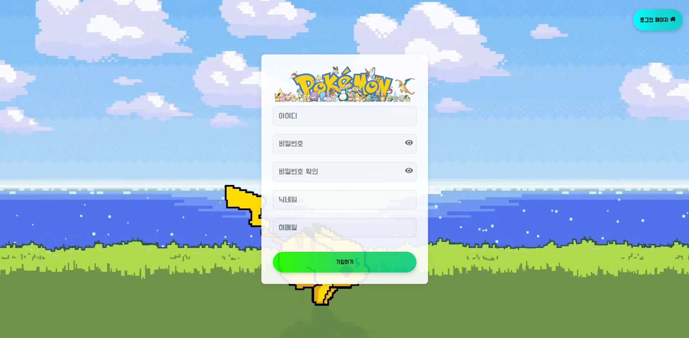

---

## 🧭 메인 페이지

📸 이미지 보기 (7장)

 

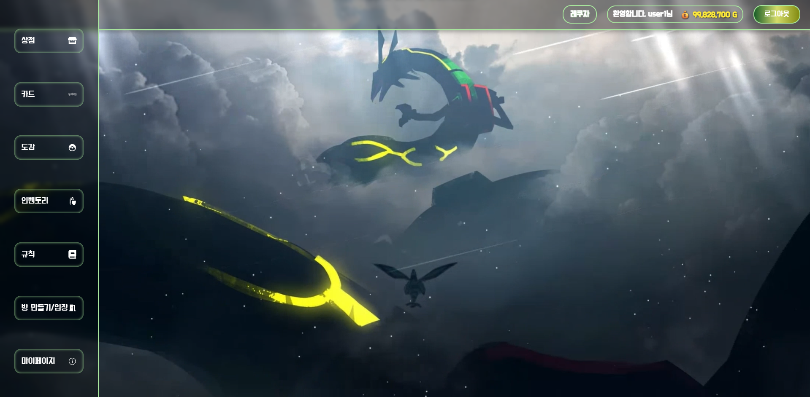
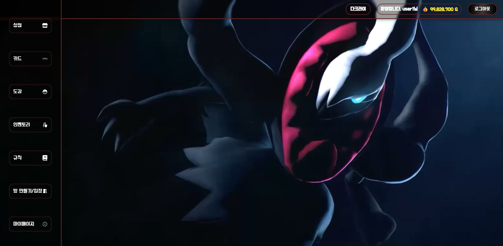
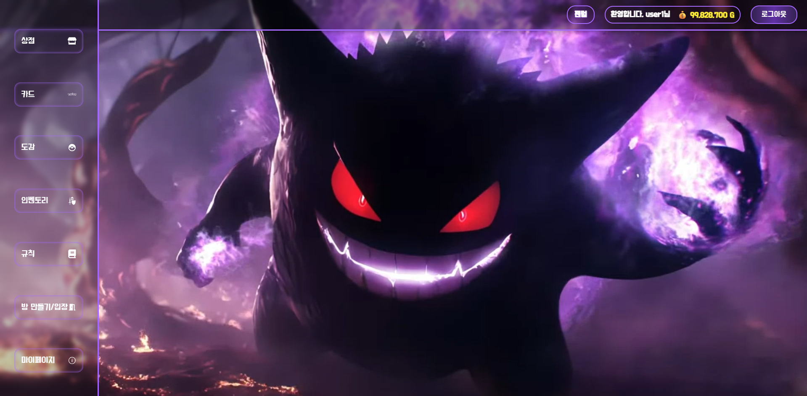
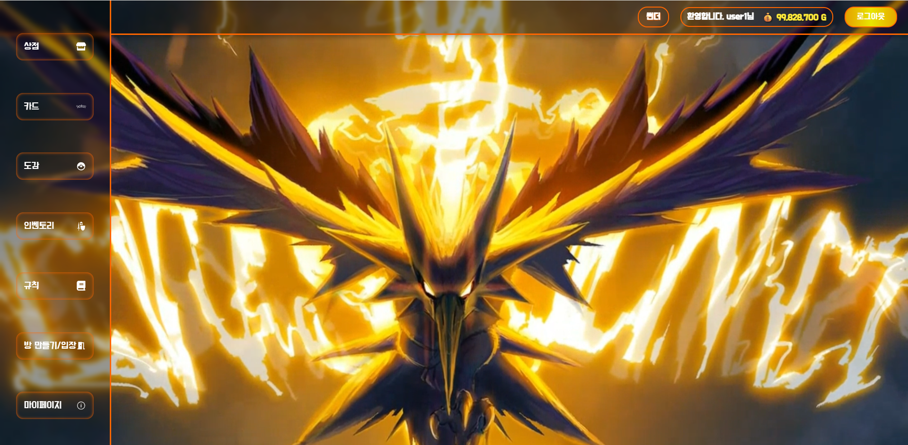
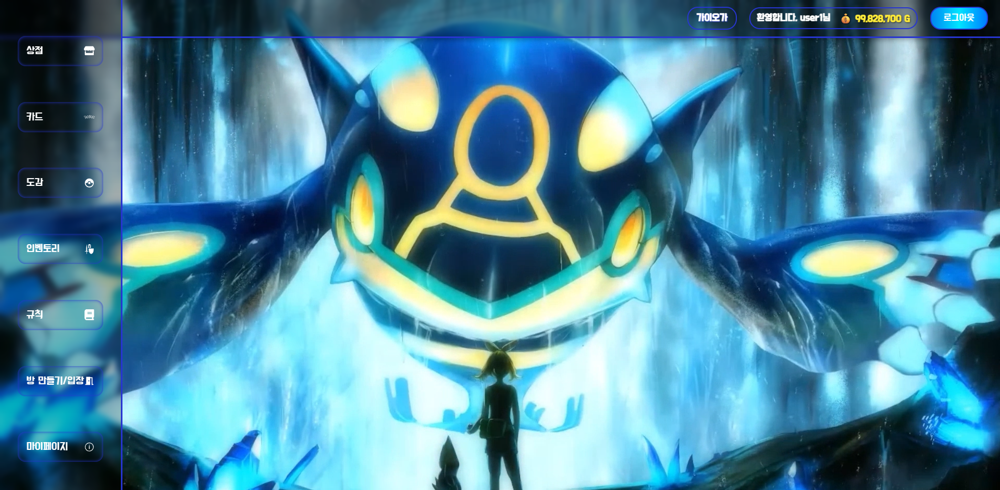
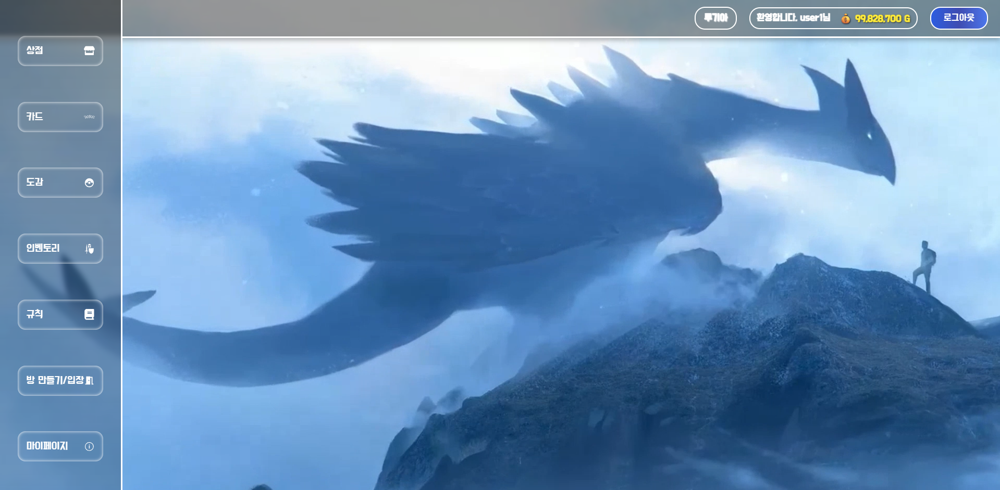
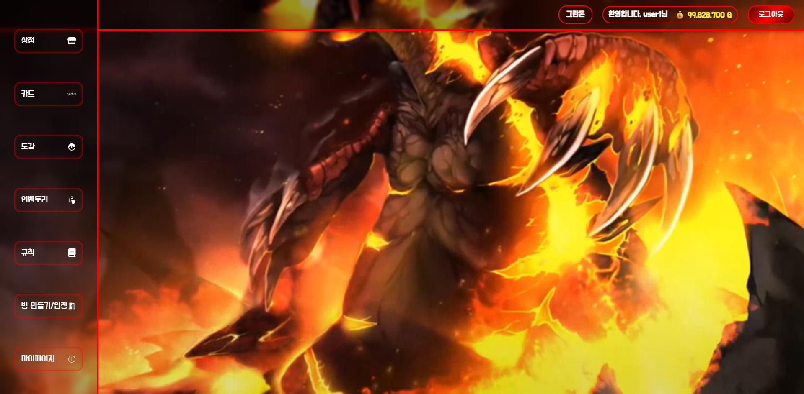

---

## 🏪 상점

📸 이미지 보기

 

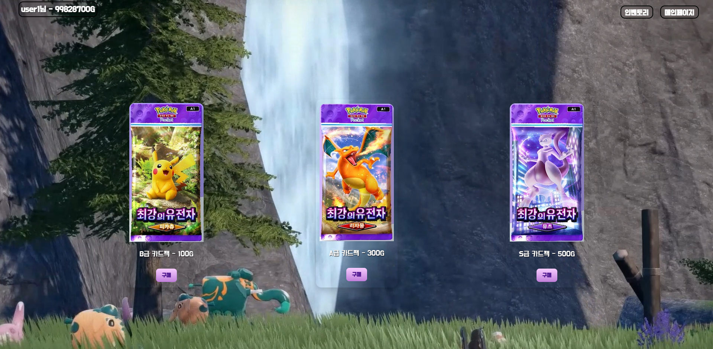

---

## 🎒 인벤토리

📸 이미지 보기

 

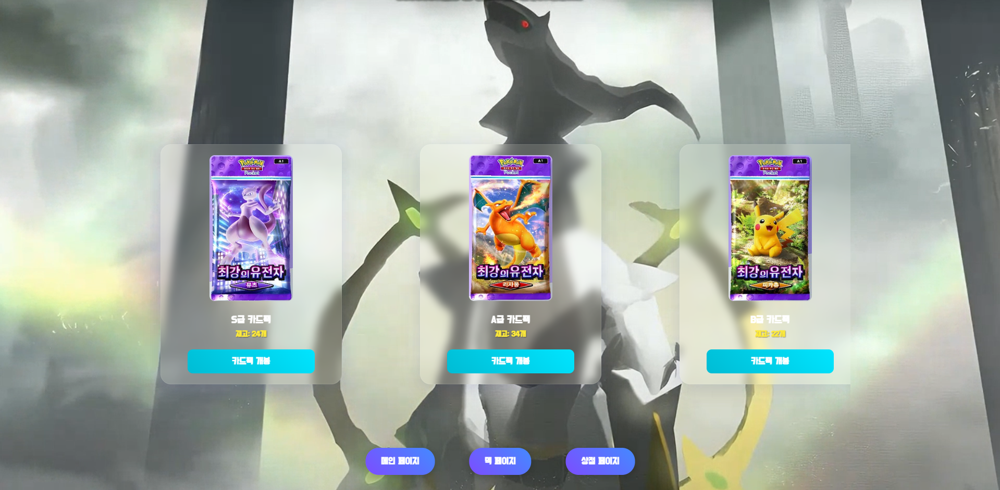
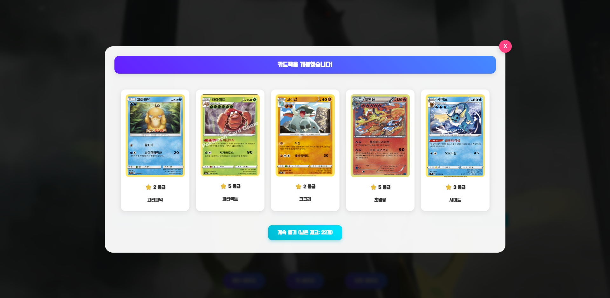

---

## 📚 덱

📸 이미지 보기

 

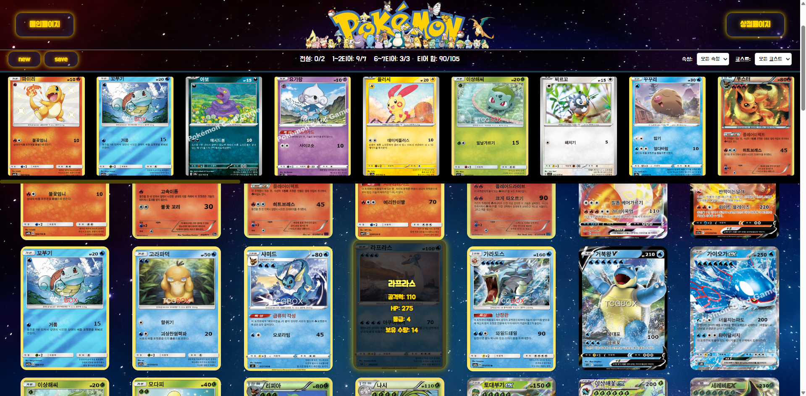

---

## 📚 3D 도감

📸 이미지 보기

 

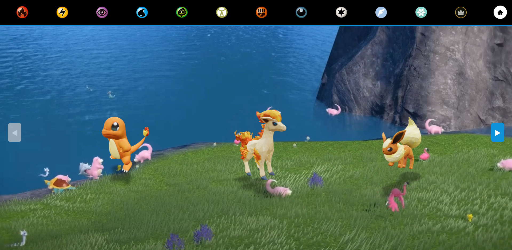

---

## ⚔ 실시간 전투

📸 이미지 보기

 

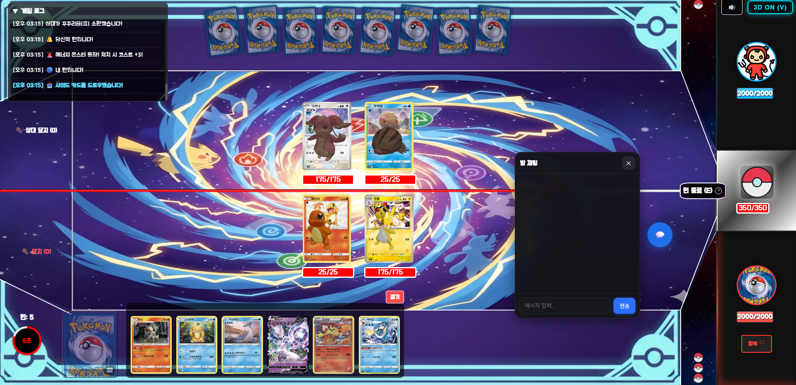

---

# ✨ 프로젝트 후기

## 👤 김민수 — 프론트엔드 & 프로젝트 구조 설계

> 1년 남짓 팀원들과 협업을 하며 프로젝트의 구조를 잡고  
> 그 틀에 맞추어 구현하는 과정을 통해  
> 프론트엔드와 백엔드 전반에 대한 지식이 늘어  
> 매우 의미 있는 경험이었습니다.
>
> 팀원들과 함께 아이디어를 실체화하는 과정에서  
> 큰 성취감을 느꼈고, 협업 역량과 기술적 이해도가  
> 확실히 성장했다고 느꼈습니다.

---

## 👤 김태중 — 백엔드 & 서버 인프라 / 전투 시스템

> 규모 있는 프로젝트 협업을 진행하면서  
> 소통 갈등, Git 병합 충돌, 기한 내 작업 부담 등  
> 다양한 난관이 있었지만,  
> 서로의 시간을 투자하며 끝까지 완성해낸 경험은  
> 매우 뿌듯하고 감격스러웠습니다.
>
> 이 프로젝트를 통해  
> "**맡은 일은 반드시 끝까지 해낼 수 있다**"는  
> 자신감을 얻게 되었고,  
> 앞으로 개발자로서의 책임감과 성장을 이어가고 싶습니다.

---

# 📝 라이선스

본 프로젝트는 개인 포트폴리오 목적이며 상업적 사용은 하지 않습니다.
